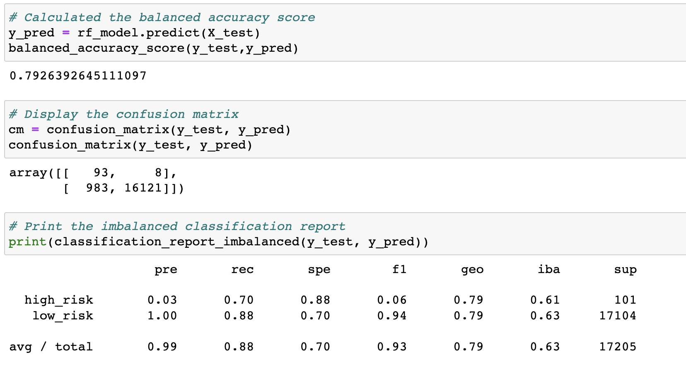

# Credit_Risk_Analysis
Challenge 17

To compare all the 6 methods used in this research we are evaluating 3 parameters: 

 - Accuracy: describes the number of correct predictions over all predictions

 - Precision: measures how many of the positive predictions made are correct (true positives). 

 - Recall: measures how many of the positive cases the classifier correctly predicted, over all the positive cases in the data.

 - F1-Score: its the harmonic mean of both precision and recall. It provides a single metric that weights the two ratios (precision and recall) in a balanced way, requiring both to have a higher value for the F1-score value to rise. 

## 1. Random Oversampling

In random oversampling, instances of the minority class are randomly selected and added to the training set until the majority and minority classes are balanced.

Balanced accuracy score: 67%

High Risk 
 - precision rate: 1%
 - recall rate: 74%
 - F1: 2%

Low Risk
 - precision rate: 100%
 - recall rate: 61%
 - F1: 75%

## 2. SMOTE Oversampling

The synthetic minority oversampling technique (SMOTE) is another oversampling approach to deal with unbalanced datasets. In SMOTE, like random oversampling, the size of the minority is increased. 

The key difference between the two lies in how the minority class is increased in size. As we have seen, in random oversampling, instances from the minority class are randomly selected and added to the minority class. In SMOTE, by contrast, new instances are interpolated. That is, for an instance from the minority class, a number of its closest neighbors is chosen. Based on the values of these neighbors, new values are created.

It's important to note that although SMOTE reduces the risk of oversampling, it does not always outperform random oversampling. 

Another deficiency of SMOTE is its vulnerability to outliers. We said earlier that a minority class instance is selected, and new values are generated based on its distance from its neighbors. If the neighbors are extreme outliers, the new values will reflect this.

Balanced accuracy score: 66%

High Risk 
 - precision rate: 1%
 - recall rate: 63%
 - F1: 2%

Low Risk
 - precision rate: 100%
 - recall rate: 69%
 - F1: 63%

## 3. Undersampling

Undersampling is another technique to address class imbalance. Undersampling takes the opposite approach of oversampling. Instead of increasing the number of the minority class, the size of the majority class is decreased.

Both oversampling and undersampling involve tradeoffs. Oversampling addresses class imbalance by duplicating or mimicking existing data. In contrast, undersampling only uses actual data. On the other hand, undersampling involves loss of data from the majority class. Furthermore, undersampling is practical only when there is enough data in the training set. There must be enough usable data in the undersampled majority class for a model to be useful.

Balanced accuracy score: 54%

High Risk 
 - precision rate: 1%
 - recall rate: 69%
 - F1: 1%

Low Risk
 - precision rate: 100%
 - recall rate: 40%
 - F1: 57%

## 4. Combination (Over and Under) Sampling - SMOTEENN

A downside of oversampling with SMOTE is its reliance on the immediate neighbors of a data point. Because the algorithm doesn't see the overall distribution of data, the new data points it creates can be heavily influenced by outliers. This can lead to noisy data. With downsampling, the downsides are that it involves loss of data and is not an option when the dataset is small. One way to deal with these challenges is to use a sampling strategy that is a combination of oversampling and undersampling.

SMOTEENN combines the SMOTE and Edited Nearest Neighbors (ENN) algorithms. SMOTEENN is a two-step process:
  - Oversample the minority class with SMOTE.
  - Clean the resulting data with an undersampling strategy.
If the two nearest neighbors of a data point belong to two different classes, that data point is dropped.

Balanced accuracy score: 64%

High Risk 
 - precision rate: 1%
 - recall rate: 72%
 - F1: 2%

Low Risk
 - precision rate: 100%
 - recall rate: 57%
 - F1: 72%

## 5. Balanced Random Forest Classifier

Instead of having a single, complex tree like the ones created by decision trees, a random forest algorithm will sample the data and build several smaller, simpler decision trees. Each tree is simpler because it is built from a random subset of features.

These simple trees are weak learners because they are created by randomly sampling the data and creating a decision tree for only that small portion of data. And since they are trained on a small piece of the original data, they are only slightly better than a random guess. However, many slightly better than average small decision trees can be combined to create a strong learner, which has much better decision-making power.

A balanced random forest randomly under-samples each boostrap sample to balance it.

Balanced accuracy score: 79%

High Risk 
 - precision rate: 3%
 - recall rate: 70%
 - F1: 6%

Low Risk
 - precision rate: 100%
 - recall rate: 88%
 - F1: 94%

## 6. Easy Ensemble AdaBoost Classifier

The classifier is an ensemble of AdaBoost learners trained on different balanced boostrap samples. The balancing is achieved by random under-sampling.

A specific method which uses AdaBoostClassifier as learners in the bagging classifier is called “EasyEnsemble”. The EasyEnsembleClassifier allows to bag AdaBoost learners which are trained on balanced bootstrap samples. 

Balanced accuracy score: 93%

High Risk 
 - precision rate: 9%
 - recall rate: 92%
 - F1: 16%

Low Risk
 - precision rate: 100%
 - recall rate: 94%
 - F1: 97%